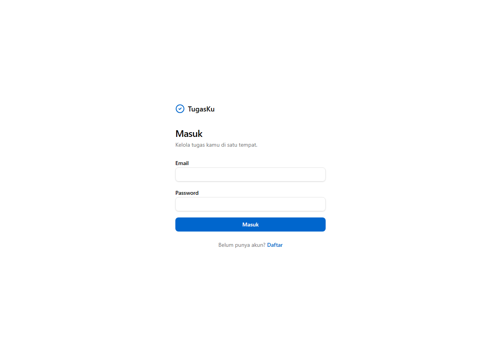
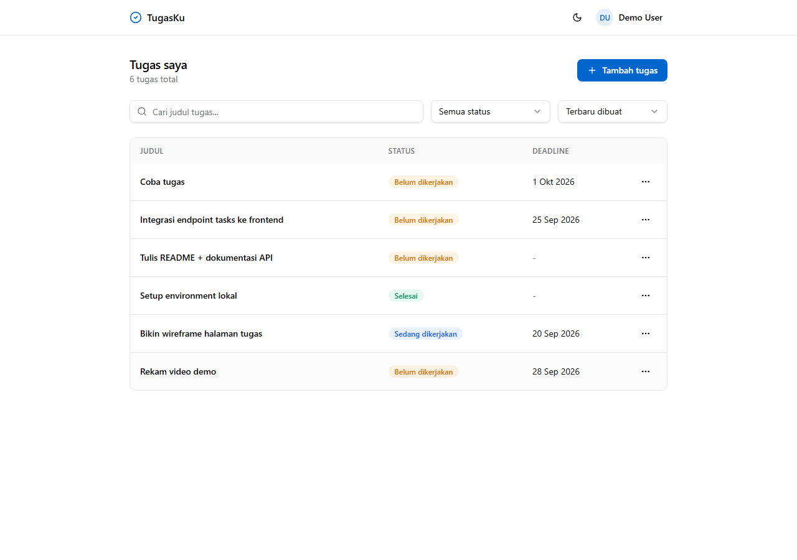
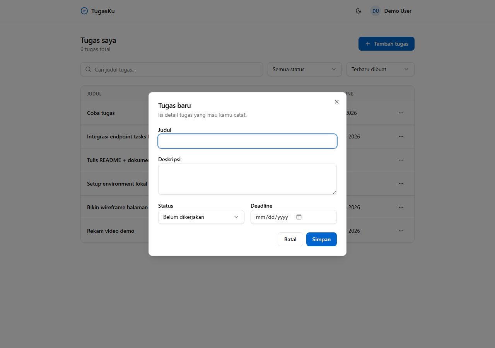
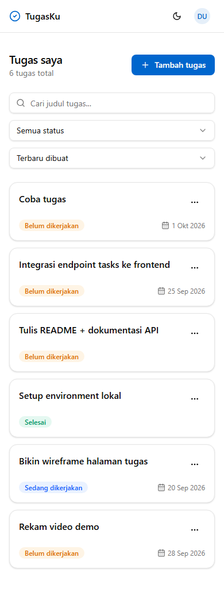

# Task Management System

Aplikasi untuk mencatat dan mengelola tugas pribadi. Ada autentikasi (register/login),
CRUD tugas, filter status, pencarian judul, dan pagination. Dibuat untuk technical test
Fullstack Web Developer.

- **Backend**: Node.js + Express, MySQL (query manual pakai `mysql2`)
- **Frontend**: React (Vite) + Tailwind, komponen mengikuti pola shadcn/ui
- **Auth**: JWT access token + refresh token (cookie httpOnly, dengan rotasi)

Akun demo setelah `npm run seed`: `demo@taskmanager.test` / `demo1234`

## Arsitektur singkat

```
backend/
  src/
    modules/            auth & tasks, masing-masing: routes -> controller -> service -> repository
    middleware/          auth (verify JWT), validate (zod), error handler, rate limit
    db/                  connection pool + file migrasi SQL
    lib/                 helper kecil (AppError, jwt, password, cookie)
frontend/
  src/
    features/            auth, tasks, theme  (tiap fitur bawa komponen + hook + api sendiri)
    components/ui/        primitives (button, dialog, select, ...)
    lib/                 axios client (+ interceptor refresh), query client
```

Kenapa refresh token: access token sengaja pendek (15 menit). Saat expired, frontend
otomatis menukar refresh token (dari cookie) jadi access token baru tanpa user login ulang.
Refresh token dirotasi tiap dipakai; kalau token lama dipakai lagi, semua sesi user dicabut.

## Tampilan

| Login | Daftar tugas | Form tugas |
|---|---|---|
|  |  |  |

Mendukung mode gelap dan tampilan mobile (list berubah jadi kartu):



## Menjalankan secara lokal (tanpa Docker)

Prasyarat: Node 20+, MySQL 8 yang jalan.

**Backend**

```bash
cd backend
cp .env.example .env          # sesuaikan kredensial DB
npm install
npm run migrate               # bikin database + tabel
npm run seed                  # opsional: data contoh + akun demo
npm run dev                   # http://localhost:4000
```

**Frontend**

```bash
cd frontend
cp .env.example .env          # boleh dibiarkan kosong, pakai proxy dev
npm install
npm run dev                   # http://localhost:5173
```

Vite mem-proxy `/api` ke `http://localhost:4000`, jadi tidak perlu setel CORS untuk dev.

## Menjalankan dengan Docker

```bash
cp .env.example .env          # isi JWT secret
docker compose up --build
```

- Frontend: http://localhost:8080
- Backend: http://localhost:4000
- MySQL: port 3307 di host

Container backend menjalankan migrasi otomatis sebelum start.

## Environment variables

**backend/.env** (lihat `backend/.env.example`)

| Nama | Keterangan |
|------|------------|
| `PORT` | port API, default 4000 |
| `CLIENT_ORIGIN` | origin frontend untuk CORS |
| `DB_HOST` / `DB_PORT` / `DB_USER` / `DB_PASSWORD` / `DB_NAME` | koneksi MySQL |
| `JWT_ACCESS_SECRET` / `JWT_REFRESH_SECRET` | secret token (wajib, min 16 char) |
| `ACCESS_TOKEN_TTL` | umur access token, default `15m` |
| `REFRESH_TOKEN_TTL_DAYS` | umur refresh token, default `7` |
| `COOKIE_SECURE` | `true` kalau di-serve lewat HTTPS |

**frontend/.env**: `VITE_API_URL` — kosongkan untuk pakai proxy dev, atau isi URL lengkap
API kalau beda origin.

## API

Ringkasan endpoint (detail: `docs/openapi.yaml`, atau buka `http://localhost:4000/docs`):

| Method | Endpoint | Keterangan |
|--------|----------|------------|
| POST | `/api/v1/auth/register` | daftar |
| POST | `/api/v1/auth/login` | login |
| POST | `/api/v1/auth/refresh` | tukar refresh token |
| POST | `/api/v1/auth/logout` | logout |
| GET | `/api/v1/auth/me` | profil |
| GET | `/api/v1/tasks` | daftar tugas; query: `status`, `search`, `page`, `limit`, `sort`, `order` |
| POST | `/api/v1/tasks` | buat tugas |
| PUT | `/api/v1/tasks/:id` | update tugas |
| DELETE | `/api/v1/tasks/:id` | hapus tugas |

Postman collection: `docs/task-manager.postman_collection.json`.

## Testing

```bash
cd backend
cp .env.test.example .env.test   # nunjuk ke DB terpisah: task_manager_test
npm test                          # jest + supertest (migrasi DB test jalan otomatis)

cd ../frontend && npm test        # vitest + testing library
```

CI (GitHub Actions) menjalankan lint + test untuk kedua sisi tiap push/PR.

## Skema database

Ada 3 tabel: `users`, `tasks` (relasi `user_id`, `ON DELETE CASCADE`), dan
`refresh_tokens`. File migrasi ada di `backend/src/db/migrations/`.

## Catatan

- Bundle frontend belum di-code-split; untuk aplikasi sekecil ini masih wajar.
- Belum ada reset password / verifikasi email — di luar scope test.
- Rate limit pakai in-memory store, cukup untuk satu instance.
